---
## Front matter
title: "Отчёт по лабораторной работе 7"
subtitle: "Архитектура компьютеров"
author: "Нурбердиев Гурбанмырад НКАбд-03-24"

## Generic otions
lang: ru-RU
toc-title: "Содержание"

## Bibliography
bibliography: bib/cite.bib
csl: pandoc/csl/gost-r-7-0-5-2008-numeric.csl

## Pdf output format
toc: true # Table of contents
toc-depth: 2
lof: true # List of figures
lot: true # List of tables
fontsize: 12pt
linestretch: 1.5
papersize: a4
documentclass: scrreprt
## I18n polyglossia
polyglossia-lang:
  name: russian
  options:
	- spelling=modern
	- babelshorthands=true
polyglossia-otherlangs:
  name: english
## I18n babel
babel-lang: russian
babel-otherlangs: english
## Fonts
mainfont: PT Serif
romanfont: PT Serif
sansfont: PT Sans
monofont: PT Mono
mainfontoptions: Ligatures=TeX
romanfontoptions: Ligatures=TeX
sansfontoptions: Ligatures=TeX,Scale=MatchLowercase
monofontoptions: Scale=MatchLowercase,Scale=0.9
## Biblatex
biblatex: true
biblio-style: "gost-numeric"
biblatexoptions:
  - parentracker=true
  - backend=biber
  - hyperref=auto
  - language=auto
  - autolang=other*
  - citestyle=gost-numeric
## Pandoc-crossref LaTeX customization
figureTitle: "Рис."
tableTitle: "Таблица"
listingTitle: "Листинг"
lofTitle: "Список иллюстраций"
lotTitle: "Список таблиц"
lolTitle: "Листинги"
## Misc options
indent: true
header-includes:
  - \usepackage{indentfirst}
  - \usepackage{float} # keep figures where there are in the text
  - \floatplacement{figure}{H} # keep figures where there are in the text
---

# Цель работы

Целью работы является изучение команд условного и безусловного переходов. Приобретение навыков написания программ с использованием переходов. Знакомство с назначением и структурой файла листинга.

# Выполнение лабораторной работы

## Реализация переходов в NASM

Создаю каталог для программ лабораторной работы № 7 и файл lab7-1.asm. 

(рис. 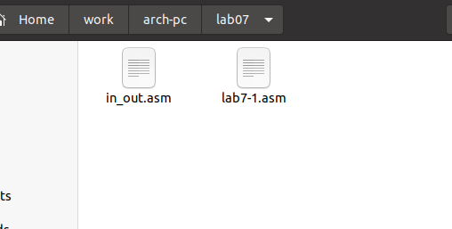{ #fig:001 width=70%, height=70% })

Инструкция jmp в NASM используется для реализации безусловных переходов. Рассмотрим пример программы с использованием инструкции jmp. Написал в файл lab7-1.asm текст программы из листинга 7.1. 

(рис. 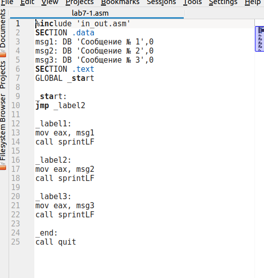{ #fig:002 width=70%, height=70% })

Создаю исполняемый файл и запускаю его. 

(рис. 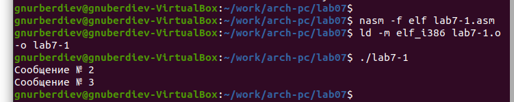{ #fig:003 width=70%, height=70% })

Инструкция jmp позволяет осуществлять переходы не только вперед, но и назад. Изменяю программу таким образом, чтобы она выводила сначала «Сообщение № 2», затем «Сообщение № 1», и завершала работу. Для этого после вывода сообщения № 2 добавляю инструкцию jmp с меткой _label1 (переход к инструкциям вывода сообщения № 1), и после вывода сообщения № 1 добавляю инструкцию jmp с меткой _end (переход к инструкции call quit).

Изменяю текст программы в соответствии с листингом 7.2. 

(рис. 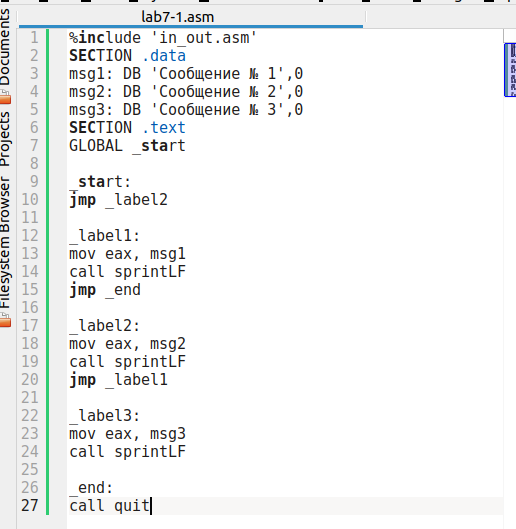{ #fig:004 width=70%, height=70% }) 

(рис. 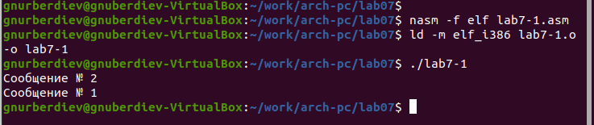{ #fig:005 width=70%, height=70% })

После изменений программа выводит следующее: Сообщение № 3 Сообщение № 2 Сообщение № 1

(рис. 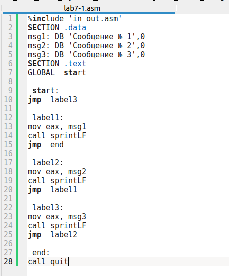{ #fig:006 width=70%, height=70% }) 

(рис. 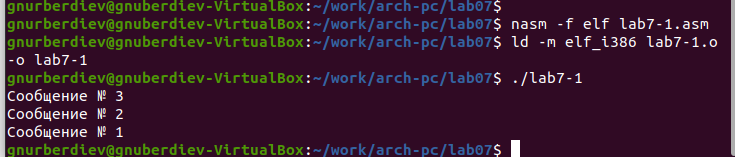{ #fig:007 width=70%, height=70% })

Использование инструкции jmp приводит к переходу в любом случае. Однако, часто при написании программ необходимо использовать условные переходы, то есть переход должен осуществляться только при выполнении определенного условия. В качестве примера рассмотрим программу, которая определяет и выводит на экран наибольшее из трех целочисленных переменных: A, B и C. Значения для A и C задаются в программе, значение B вводится с клавиатуры.

Создаю исполняемый файл и проверяю его работу для различных значений 

(рис. 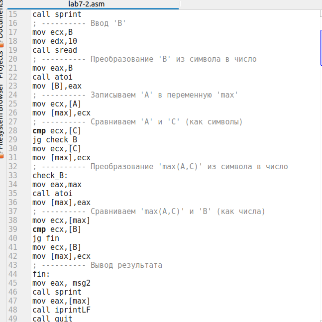{ #fig:008 width=70%, height=70% }) 

(рис. 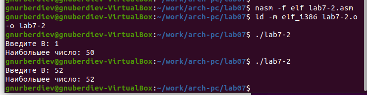{ #fig:009 width=70%, height=70% })

## Изучение структуры файла листинга

Обычно nasm создает в результате ассемблирования только объектный файл. Чтобы получить файл листинга, необходимо указать ключ -l и задать имя файла листинга в командной строке.

Создаю файл листинга для программы из файла lab7-2.asm. 

(рис. 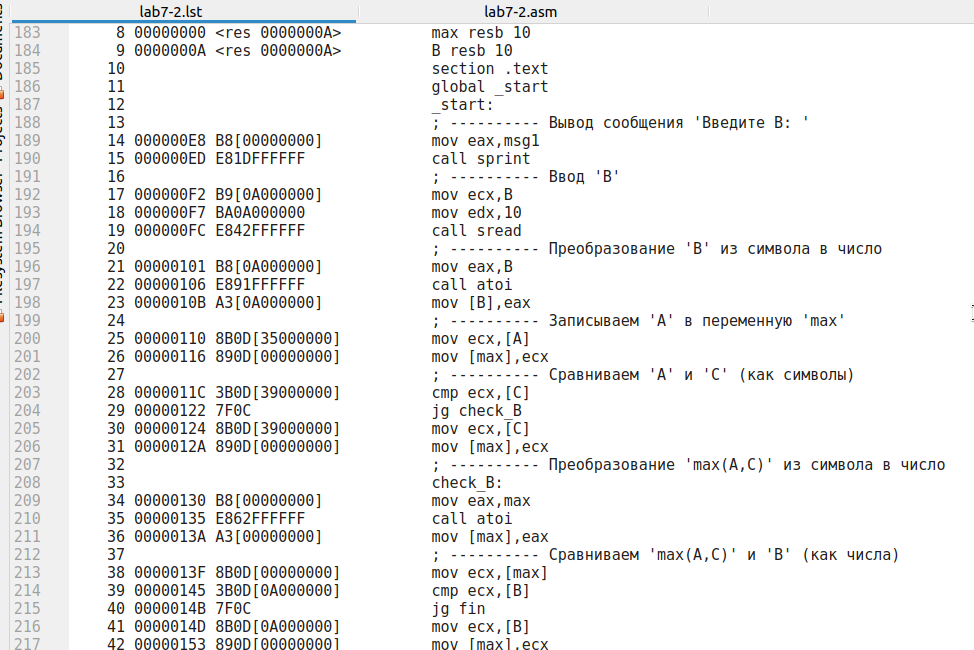{ #fig:010 width=70%, height=70% })

Ознакомимся с его форматом и содержимым.

- строка 211:
  - 34 - номер строки
  - 0000012E - адрес
  - B8[00000000] - машинный код
  - mov eax,max - код программы
- строка 212:
  - 35 - номер строки
  - 00000133 - адрес
  - E864FFFFFF - машинный код
  - call atoi - код программы
- строка 213:
  - 36 - номер строки
  - 00000138 - адрес
  - A3[00000000] - машинный код
  - mov [max],eax - код программы

Открываю файл с программой lab7-2.asm и удаляю один операнд из инструкции с двумя операндами. Затем выполняю трансляцию с получением файла листинга. 

(рис. { #fig:011 width=70%, height=70% }) 

(рис. 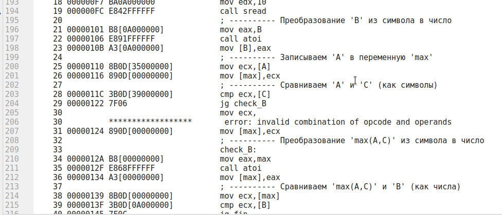{ #fig:012 width=70%, height=70% })

Объектный файл не смог создаться из-за ошибки, но файл листинга с выделенным местом ошибки был получен.

## Самостоятельное задание

Напишите программу нахождения наименьшей из трех целочисленных переменных a, b и c. Значения переменных выбрать из таблицы 7.5 в соответствии с вариантом, полученным при выполнении лабораторной работы № 6. Создаю исполняемый файл и проверяю его работу 

(рис. 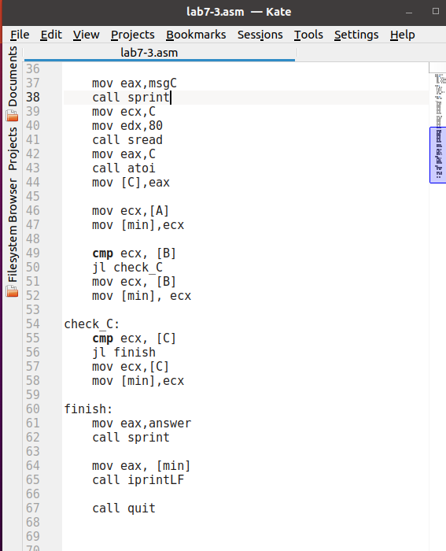{ #fig:013 width=70%, height=70% }) 

(рис. 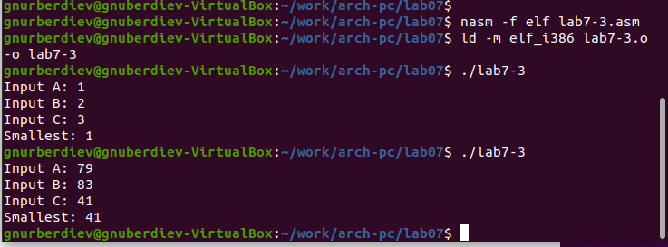{ #fig:014 width=70%, height=70% })

Для варианта 6 - 79,83,41 

Напишите программу, которая для введенных с клавиатуры значений x и a вычисляет значение заданной функции f(x) и выводит результат вычислений. Вид функции f(x) выбрать из таблицы 7.6 вариантов заданий в соответствии с вариантом, полученным при выполнении лабораторной работы № 7. Создаю исполняемый файл и проверяю его работу для значений X и a из 7.6. 

(рис. 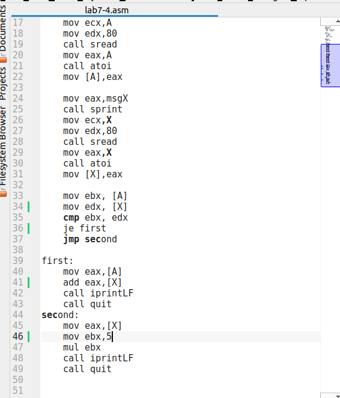{ #fig:015 width=70%, height=70% }) 

(рис. 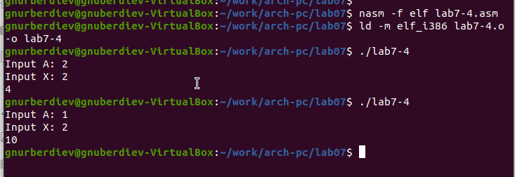{ #fig:016 width=70%, height=70% })

Для варианта 6:

$$
\begin{cases}
    x+a, &  x = a \\
    5x, & x \ne a
\end{cases}
$$

При (x = 2, a = 2) получается 4

При (x = 2, a = 1) получается 10

# Выводы

Изучили команды условного и безусловного переходов, познакомились с фалом листинга.